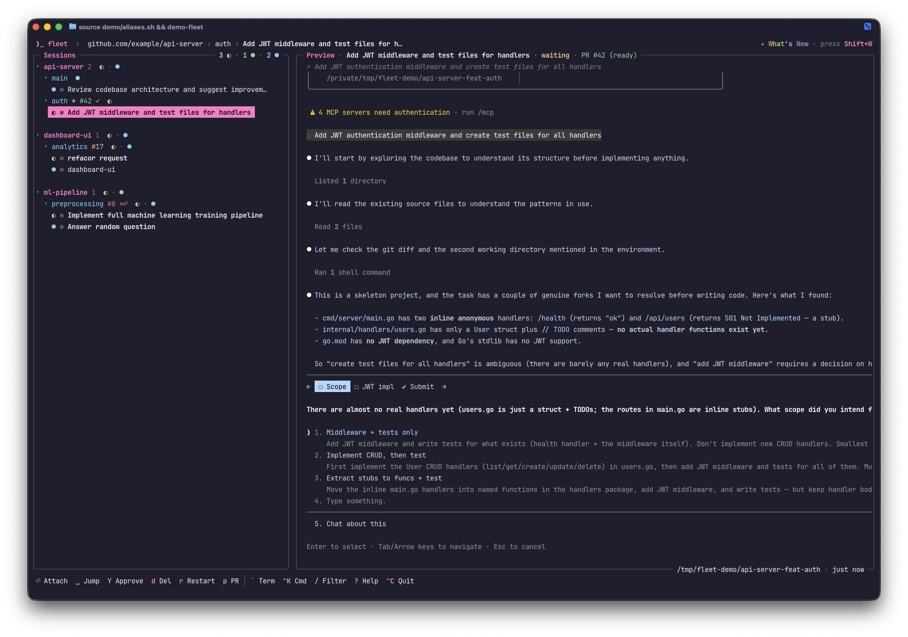

<p align="center">
  
  <h1 align="center">fleet</h1>
  <p align="center">
    <strong>Run 10 coding agents. Stay sane.</strong>
  </p>
  <p align="center">
    A terminal cockpit for orchestrating Claude Code, Codex &amp; OpenCode sessions in parallel.
    <br />
    See which agents need you. Jump in, direct, jump out.
  </p>
  <p align="center">
    <a href="https://brizzai.github.io/fleet/">Website</a>
    &middot;
    <a href="https://brizzai.github.io/fleet/docs/">Docs</a>
  </p>
  <p align="center">
    <a href="https://goreportcard.com/report/github.com/brizzai/fleet"></a>
    <a href="https://github.com/brizzai/fleet/releases/latest"></a>
    <a href="LICENSE"></a>
    <a href="https://golang.org/doc/devel/release.html"></a>
    <a href="https://github.com/brizzai/fleet/actions/workflows/ci.yml"></a>
  </p>
</p>

<br />

<p align="center">
  
</p>

<p align="center">
  <em>Sessions grouped by repo &middot; Real-time status via hooks &middot; PR state &middot; One-key approve</em>
</p>

<br />

Your agents are coding. fleet keeps you in control.

- 👀 **See** — every session's live status in one sidebar: running, waiting for you, finished
- ⚡ **Act** — **`Space`** jumps to the agent that needs you, **`Enter`** drops you in to approve or steer
- 🚀 **Ship** — branch, dirty state, and full PR status (CI, reviews, threads) on every repo header

## Install

### Homebrew (recommended)

```bash
brew install brizzai/tap/fleet
```

### Shell script

```bash
curl -fsSL https://raw.githubusercontent.com/brizzai/fleet/master/install.sh | bash
```

Requires [`gh`](https://cli.github.com/).

### Go install

```bash
go install github.com/brizzai/fleet/cmd/fleet@latest
```

Requires Go 1.26+.

### Requirements

- macOS
- [tmux](https://github.com/tmux/tmux) (`brew install tmux`)
- [Claude Code](https://docs.anthropic.com/en/docs/claude-code), [Codex](https://developers.openai.com/codex), or [OpenCode](https://opencode.ai) — at least one

## Quick Start

```bash
# Launch
fleet

# 'a' — new session in current repo (default agent)
# 'A' — new session, pick the agent (Claude Code / Codex / OpenCode)
# 'n' — new session at any path (autocomplete)
# '?' — all keybindings
```

## Features

### Claude Code, Codex, or OpenCode — per session

Pick the agent when you create a session: **`a`** fires instantly with your default agent, **`A`** opens a picker. Run Claude, Codex, and OpenCode sessions side by side in the same repo. Status, resume, and auto-naming work identically across all three — driven by each agent's own hooks, not terminal scraping.

### Real-Time Status

Every agent's state, always visible. Hook-based detection for Claude Code, Codex, and OpenCode — no polling, no delay.

`● running` &nbsp; `◐ waiting` &nbsp; `● finished` &nbsp; `○ idle` &nbsp; `✕ error`

### Jump In, Direct, Jump Out

**`Space`** jumps to the next session that needs attention. **`Enter`** drops you in — read what the agent is asking, approve, or type a course correction. **`Ctrl+Q`** detaches, and you're on to the next one. Already trust the prompt? **`Y`** approves without attaching.

### Git-Native Sessions

Sessions live under their repo. Branch name, dirty state, and full PR status on every header — CI pass/fail, review state, changes requested, unresolved threads. Collapse groups, filter with **`/`**, switch branches with **`b`**. Requires [`gh`](https://cli.github.com/) for PR info (optional).

### Worktrees

**`w`** creates a new worktree with branch picker. Zero config — works with any repo. Each worktree gets its own isolated session. Custom workspace commands via `.fleet.json` if you need them.

### Fork Sessions

**`f`** forks a session — branches off the agent's conversation at that point. Try a different approach without losing the original. Both sessions keep running independently.

### Terminal drawer

**`` ` ``** opens a live terminal drawer — real shells (dev servers, log tails, scratch commands) scoped to the current repo or worktree, rendered through a true terminal emulator so streaming output, colors, and full-screen tools (vim, htop, lazygit) just work. New/close tabs with **`Ctrl+T`** / **`Ctrl+W`**, switch with **`PgUp`/`PgDn`**, **`Ctrl+G`** for full-screen attach.

### And more

- **Session resume** — restart with **`r`**, the agent picks up exactly where it left off (`claude --resume` / `codex resume` / `opencode --session`)
- **Idle-session suspend** — when memory runs low, fleet hibernates your most-idle sessions (each resumed agent holds ~400MB) and brings them back right where they were on **`Enter`**
- **Full terminal attach** — **`Enter`** for full PTY, **`Tab`** for split mode (beta), **`Ctrl+Q`** to detach
- **Auto-naming** — sessions title themselves from your prompt
- **6 themes** — fleet-pink (default), tokyo-night, catppuccin-mocha, rose-pine, nord, gruvbox (**`S`** to switch)
- **Chrome tab control** — **`p`** opens PR in Chrome, reuses existing tab
- **Bug reports** — **`!`** captures diagnostics and opens a pre-filled GitHub issue

## Why fleet?

There are a dozen multi-agent session managers now. Most try to support every AI CLI under the sun by shimming keystrokes and scraping terminal output — broad support, shallow understanding of any one agent.

fleet goes the other way: **deep integration with the agents that expose real hooks — Claude Code, Codex, and OpenCode.** Every feature is built on how those agents actually work — hook events, conversation resume, session IDs, prompt structure — not a generic "send keystrokes and hope" layer. Pick the agent per session (**`A`**), or set a default and fire with **`a`**.

### vs. the alternatives

|                                     | fleet | claude-squad | ccmanager | agent-deck |
|-------------------------------------|:----------:|:------------:|:---------:|:----------:|
| **Status detection**                | ✅ Hooks (real-time) | ⚠️ Pane scraping | ⚠️ Pane scraping | ✅ Hooks |
| **PR state** (CI + reviews + threads) | ✅ | — | — | — |
| **Smart session naming**            | ✅ | — | — | — |
| **Fork conversation**              | ✅ | — | — | ✅ |
| **Open PR in browser**             | ✅ | — | — | — |
| **Session resume**                  | ✅ | — | — | ✅ |
| **Git worktrees**                   | ✅ | ✅ | ✅ | ✅ |
| **Hook-based multi-agent**          | ✅ Claude + Codex + OpenCode | — | — | — |
| **Many agents** (Gemini, Aider…)    | — | ✅ | ✅ | ✅ |
| **Linux**                           | — | ✅ | ✅ | ✅ |
| **No tmux dependency**              | — | — | ✅ | — |

**The trade-off is intentional.** claude-squad and ccmanager support 5+ agents — but treat them all the same, scraping the terminal and hoping. fleet supports Claude Code, Codex, and OpenCode, and *knows what they are*: it reads their hook events for instant status, resumes their conversations by session ID, knows your PR has 2 unresolved threads, names sessions from your actual prompt. That depth is only possible by going deep on the agents built to support it.

If you drive Claude Code, Codex, or OpenCode and want the tightest integration, this is it.

## Keybindings

| Key | Action |
|-----|--------|
| `j` / `k` | Navigate up/down |
| `Enter` | Attach to session |
| `Ctrl+Q` | Detach from session |
| `Tab` | Focus/unfocus preview (split mode, beta) |
| `Space` | Jump to next waiting/finished session |
| `a` | New session (current repo, default agent) |
| `A` | New session (pick agent: Claude Code / Codex / OpenCode) |
| `n` | New session (any path, autocomplete) |
| `w` | New worktree session |
| `Y` | Quick approve waiting prompt |
| `f` | Fork session |
| `d` | Delete session |
| `r` | Restart session |
| `R` | Rename session |
| `b` | Switch git branch |
| `e` | Open in editor |
| `p` | Open PR in browser |
| `/` | Filter sessions |
| `` ` `` | Toggle terminal drawer |
| `Ctrl+K` | Command palette |
| `S` | Settings |
| `!` | Bug report / diagnostics |
| `?` | Help |
| `Ctrl+C` | Quit |

The full keymap (session slots, undo delete, drawer chords) lives in the in-app help — press `?`.

## Contributing

See [CONTRIBUTING.md](.github/CONTRIBUTING.md) for development setup and guidelines.

## License

Apache 2.0
